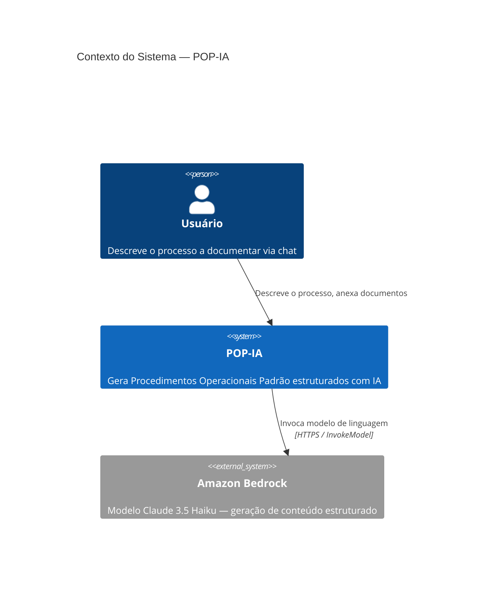
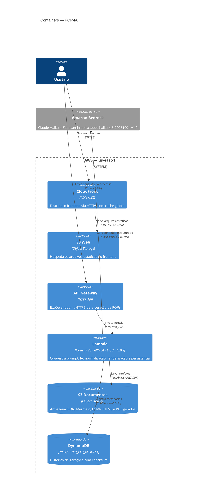
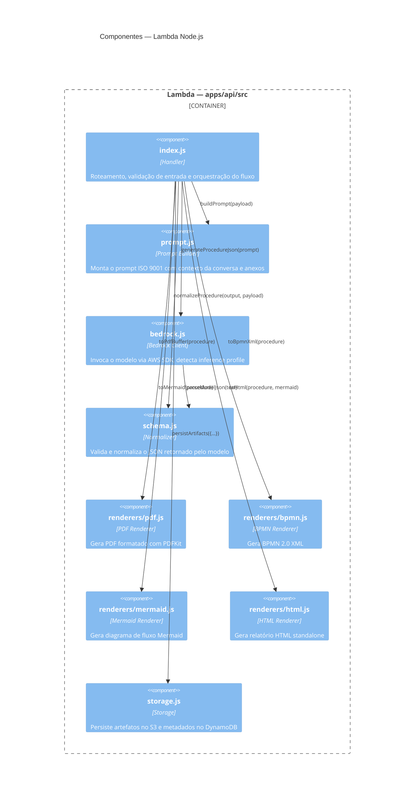
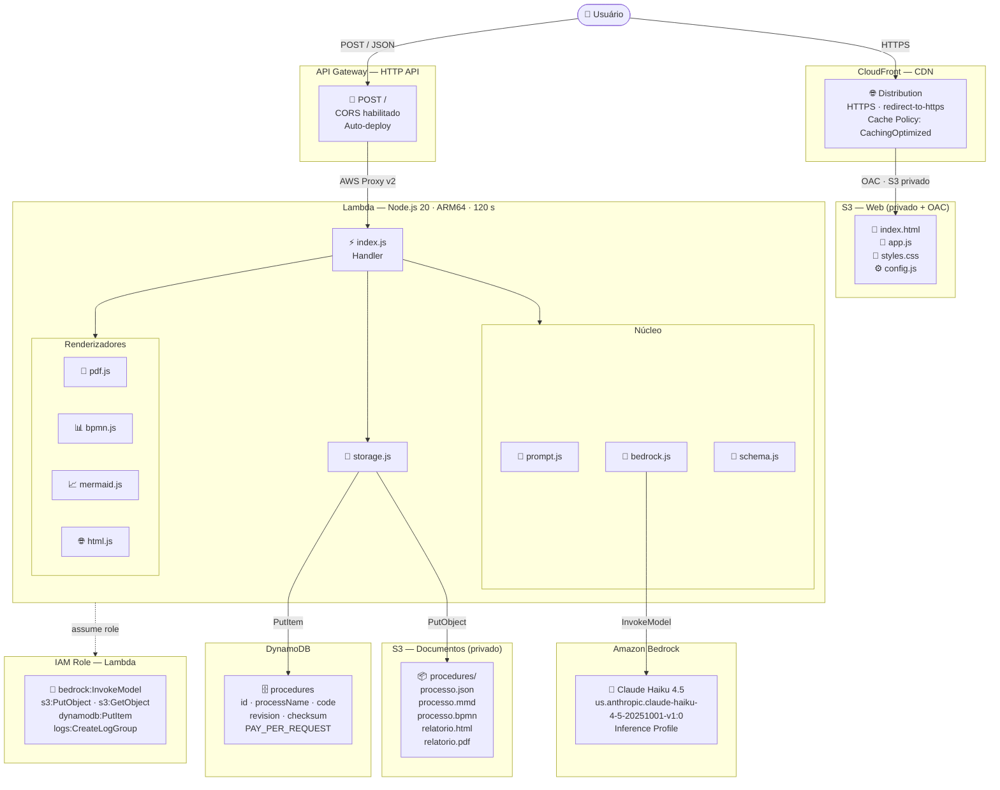
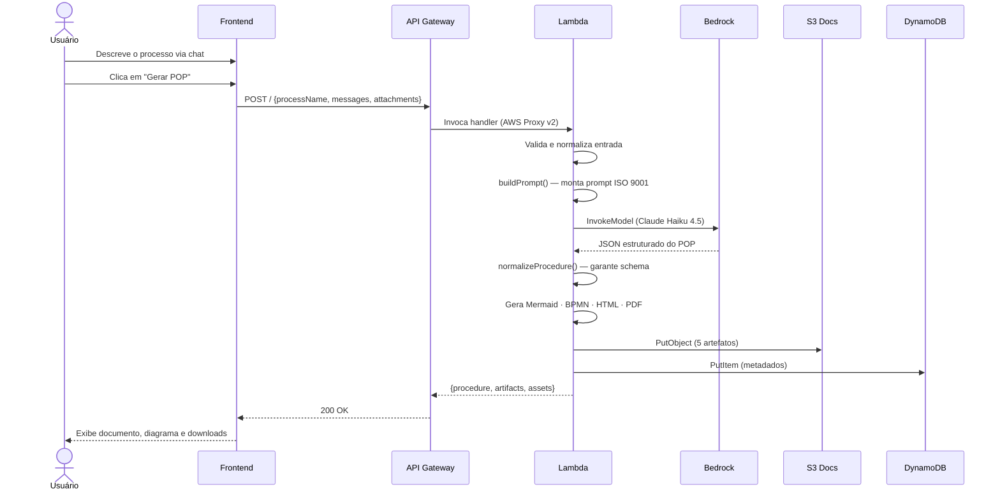

# POP-IA — Gerador de Procedimentos Operacionais Padrão com IA

Gera POPs no padrão ISO 9001 a partir de uma conversa em linguagem natural, usando Amazon Bedrock (Claude). Produz documento, diagrama de fluxo, BPMN 2.0 e PDF prontos para uso.

---

## Diagramas de Arquitetura

### C4 — Nível 1: Contexto



---

### C4 — Nível 2: Containers



---

### C4 — Nível 3: Componentes da Lambda



---

### Arquitetura AWS



---

## Fluxo de Geração



---

## Stack

| Camada | Tecnologia |
|---|---|
| Frontend | HTML · CSS · JavaScript (vanilla) · Mermaid.js |
| CDN | Amazon CloudFront + S3 (OAC) |
| API | Amazon API Gateway HTTP API |
| Backend | AWS Lambda · Node.js 20 · ARM64 · 120 s |
| IA | Amazon Bedrock — Claude Haiku 4.5 (inference profile) |
| Documentos | Amazon S3 |
| Metadados | Amazon DynamoDB (PAY_PER_REQUEST) |
| IaC | Terraform >= 1.5 · AWS Provider ~> 5.0 |
| CI/CD | GitHub Actions |

---

## Outputs gerados por POP

| Arquivo | Formato | Descrição |
|---|---|---|
| `processo.json` | JSON | Schema estruturado do POP |
| `processo.mmd` | Mermaid | Diagrama de fluxo |
| `processo.bpmn` | BPMN 2.0 XML | Processo para editores BPMN |
| `relatorio.html` | HTML | Relatório standalone |
| `relatorio.pdf` | PDF | Documento final formatado |

---

## Rodar localmente (modo demo)

```bash
# Instalar dependências
npm install --prefix apps/api

# Terminal 1 — API (sem Bedrock, usa fallback)
npm run api:local

# Terminal 2 — Frontend
npm run web:local
```

Acesse `http://localhost:5173`.

---

## Deploy na AWS

### Pré-requisitos (uma única vez)

```bash
# 1. Configurar credenciais AWS
aws configure

# 2. Criar bucket de estado do Terraform
./scripts/bootstrap.sh

# 3. Preencher variáveis
cp infra/terraform.tfvars.example infra/terraform.tfvars
# editar: definir bedrock_model_id

# 4. Habilitar o modelo no console AWS
# Bedrock → Model catalog → Claude Haiku 4.5 → Subscribe/Enable
```

### Comandos

```bash
make deploy    # sobe toda a infraestrutura (~15 min pela CloudFront)
make update    # atualiza apenas o código da Lambda e frontend
make destroy   # remove tudo da AWS após a demonstração
make local     # roda API + frontend localmente
```

### GitHub Actions (CI/CD)

| Workflow | Trigger | Descrição |
|---|---|---|
| **Deploy** | Manual (Run workflow) | Build + terraform apply |
| **Destroy** | Manual + confirmação `DESTROY` | terraform destroy |

**Secrets necessários no repositório:**

| Secret | Valor |
|---|---|
| `AWS_ACCESS_KEY_ID` | Chave de acesso AWS |
| `AWS_SECRET_ACCESS_KEY` | Chave secreta AWS |
| `AWS_REGION` | `us-east-1` |
| `TF_STATE_BUCKET` | Nome do bucket gerado pelo `bootstrap.sh` |
| `BEDROCK_MODEL_ID` | `us.anthropic.claude-haiku-4-5-20251001-v1:0` |

---

## Como obter bons resultados

A **estrutura** do POP é sempre a mesma (template ISO 9001 fixo em `prompt.js`). O que varia é o **conteúdo**, que depende do que o usuário descreve no chat.

| Entrada | Resultado |
|---|---|
| Campo "Processo" vazio + chat vazio | POP genérico com etapas-padrão ("Processo não identificado") |
| Nome do processo preenchido | Claude infere etapas prováveis para aquele processo |
| Descrição detalhada no chat | POP fiel ao processo real descrito |
| Anexo com fluxo, formulário ou política | POP enriquecido com o conteúdo do documento |

**Dica para a demonstração:** antes de clicar em "Gerar POP", peça ao aluno para descrever no chat as etapas principais, quem é o responsável, quais documentos são gerados e quais são as exceções do processo. Quanto mais contexto, melhor o resultado.

---

## Configurações de geração (Bedrock)

| Variável de ambiente | Valor padrão | Descrição |
|---|---|---|
| `BEDROCK_MODEL_ID` | — | Inference profile ID do modelo no Bedrock |
| `BEDROCK_MAX_TOKENS` | `3000` | Limite de tokens gerados por chamada |
| `BEDROCK_TEMPERATURE` | `0.2` | Grau de criatividade (0 = determinístico) |

> **Por que 3000 tokens?** O API Gateway HTTP API tem timeout fixo de **30 segundos**. Com 6000 tokens (padrão original) o modelo levava 30–36 s e retornava `503 Service Unavailable`. Com 3000 tokens a resposta chega em ~15 s. Para processos simples 3000 tokens é suficiente; para processos muito complexos é possível aumentar com um deploy local (`make deploy`) ou ajustando o secret `BEDROCK_MAX_TOKENS`.

---

## Divisão da equipe

| Papel | Responsável | Arquivos |
|---|---|---|
| Frontend | Aluno 1 | `apps/web/` |
| Backend IA | Aluno 2 | `apps/api/src/bedrock.js` · `prompt.js` · `schema.js` |
| Renderizadores | Aluno 3 | `apps/api/src/renderers/` |
| Infraestrutura | Integração | `infra/` · `scripts/` · `.github/` |

**Entrega: 06/05/2026**
Alteraro por Rafael